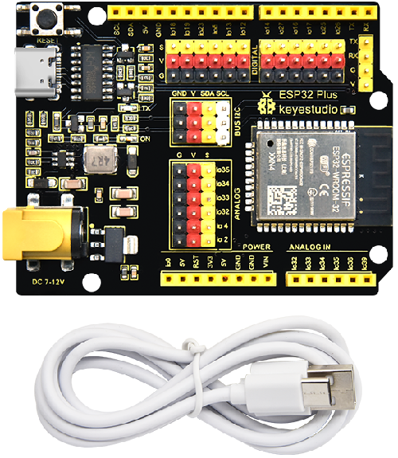
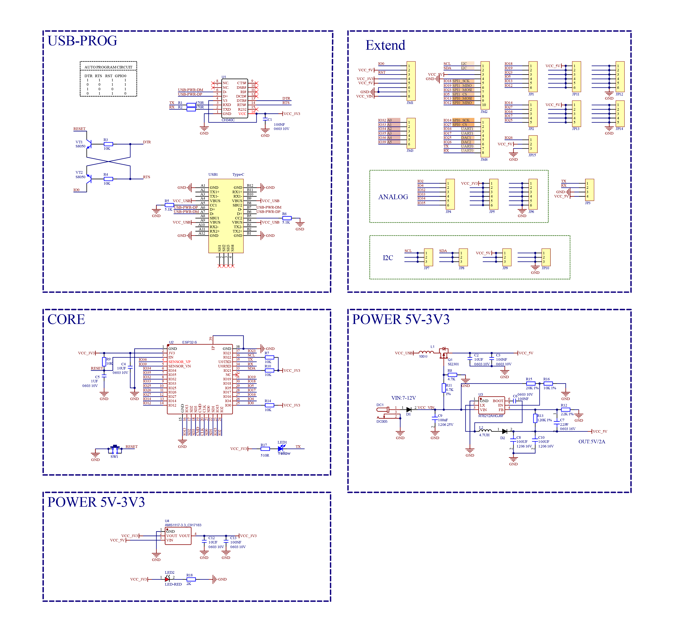
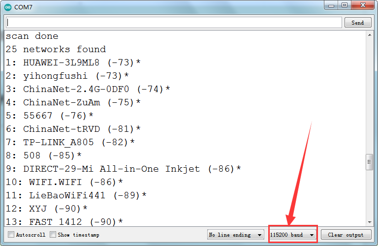

# Keyestudio ESP32 Development Board



## 1.Description

This is a development board based on ESP32, integrated with ESP32-WROOM-32 module, is a universal WIFI plus Bluetooth development board, and the pins are compatible with Arduino.

It has a host of peripherals such as hall sensor, high-speed SDIO/SPI, UART, I2S as well as I2C. Furthermore,it can be equipped with freeRTOS operating system, which is quite suitable for the Internet of things and smart home solutions.

------

## 2.Specifications

|               Voltage               |       3.3V-5V        |
| :---------------------------------: | :------------------: |
|               Current               | Output 1.2A(maximum) |
|            Maximum power            |      Output 10W      |
|         Working temperature         |       -10℃~50℃       |
|              Dimension              |    69\*54\*14.5mm    |
|               Weight                |        25.5g         |
| Environmental protection attributes |         ROHS         |

------

## 3.Pin out


## 4.Schematic Diagram



<span style="color:red">Note: Click the link to start learning how to download software, install drivers, upload code, and install library files.</span>

[https://getting-started-with-arduino.readthedocs.io](https://docs.keyestudio.com/projects/Arduino/en/latest/Arduino%20IDE%20Tutorial.html)

------

## 5.Test Code

[code](code.zip)

After uploading the code, ESP32 will find nearby WIFI and print the name and signal strength via the serial port every 5s.

```c++
#include "WiFi.h"

void setup()
{
    Serial.begin(115200);

    // Set WiFi to station mode and disconnect from an AP if it was previously connected
    WiFi.mode(WIFI_STA);
    WiFi.disconnect();
    delay(100);

    Serial.println("Setup done");
}

void loop()
{
    Serial.println("scan start");

    // WiFi.scanNetworks will return the number of networks found
    int n = WiFi.scanNetworks();
    Serial.println("scan done");
    if (n == 0) {
        Serial.println("no networks found");
    } else {
        Serial.print(n);
        Serial.println(" networks found");
        for (int i = 0; i < n; ++i) {
            // Print SSID and RSSI for each network found
            Serial.print(i + 1);
            Serial.print(": ");
            Serial.print(WiFi.SSID(i));
            Serial.print(" (");
            Serial.print(WiFi.RSSI(i));
            Serial.print(")");
            Serial.println((WiFi.encryptionType(i) == WIFI_AUTH_OPEN)?" ":"*");
            delay(10);
        }
    }
    Serial.println("");

    // Wait a bit before scanning again
    delay(5000);
}
```

------

## 6.Test Result

After uploading the code, open the serial port and we empower to see the wifi found by ESP32. 




